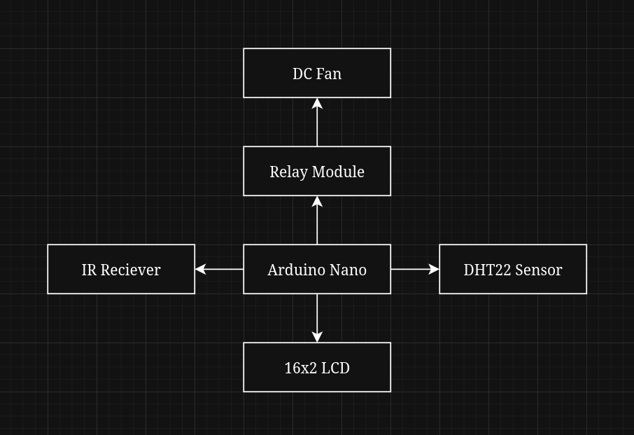

# NAVI Fan Controller
NAVI Fan Controller is an Arduino-based fan control system with an IR remote control,
built-in temperature and humidity monitoring, and optional temperature-based automatic control.

## How it works
NAVI Fan Controller has two modes: manual (TC0) and automatic (TC1). The system is turned ON/OFF with an IR remote.
In manual mode, the fan is turned on when the system is on. In automatic mode, the fan is controlled based on the measured temperature.
It turns ON when the temperature reaches the configured threshold, and turns off when the temperature drops below the configured hysteresis threshold.
While the system is enabled, DHT22 measures temperature and humidity every 2 seconds, which are then displayed on the LCD.

## Logic

## Features
- IR remote system control (works with any IR remote)
- Temperature and humidity monitoring
- Information display on a 16x2 I2C LCD
- Optional configurable automatic temperature control
- Hysteresis for smooth fan operation
- Relay-based fan control

## Hardware
- Arduino Nano
- DHT22 temperature and humidity sensor module
- IR receiver module
- 16x2 I2C LCD
- Relay module
- DC fan

## Libraries
- [IRremote](https://github.com/Arduino-IRremote/Arduino-IRremote)
- [DHT sensor library](https://github.com/adafruit/DHT-sensor-library)
- [LiquidCrystal I2C](https://github.com/johnrickman/LiquidCrystal_I2C)
- `Wire.h` (included in Arduino framework)

## Pinout
- IR receiver -> D2
- Relay -> D3
- DHT22 -> D4
- LCD SDA -> A4
- LCD SCL -> A5
